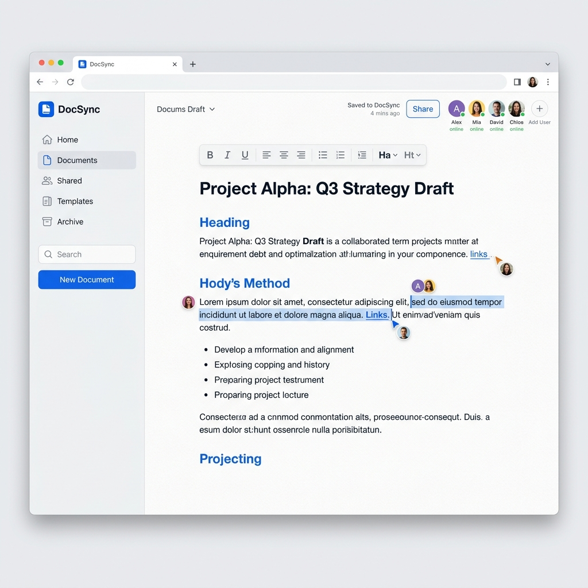

# 📄 DocSync

[](https://opensource.org/licenses/MIT)
[](https://reactjs.org/)
[](https://vitejs.dev/)
[](https://supabase.com/)
[](https://tailwindcss.com/)

**DocSync** is a premium, real-time collaborative document editor designed for seamless teamwork. It combines the power of **Yjs** and **Tiptap** with a modern, "paper-like" interface to provide a distraction-free writing experience.



## ✨ Features

- **🚀 Real-time Collaboration**: Edit documents simultaneously with multiple users. See presence indicators and live cursor movements.
- **📑 Template Gallery**: Start quickly with professional templates for Meeting Notes, Project Briefs, Daily Journals, and more.
- **🔍 Advanced Search**: Instant, server-side search across all your documents.
- **🕒 Version History**: Automatically snapshots your progress every 30 seconds. Restore any previous version with a single click.
- **💬 Comments & Mentions**: Discuss changes directly within the document with built-in commenting support.
- **📤 Smart Export**: Export your documents to HTML or print them with optimized styling.
- **🌗 Dark Mode**: Seamlessly switch between light and dark themes with a system-aware UI.
- **🗑️ Advanced Trash**: Manage deleted documents with a secure, two-step permanent deletion process.

## 🛠️ Tech Stack

### Frontend
- **Framework**: React 18 + TypeScript
- **Bundler**: Vite
- **Styling**: Tailwind CSS + Radix UI (via Shadcn UI)
- **Editor Core**: Tiptap (Pro-grade extensions)
- **State Management**: Zustand
- **Data Fetching**: TanStack Query (React Query)

### Backend & Infrastructure
- **Database**: PostgreSQL (via Supabase)
- **Authentication**: Supabase Auth
- **Real-time Sync**: Supabase Realtime (Presence & Broadcast)
- **Storage**: Supabase Storage

## 🚀 Getting Started

### Prerequisites
- [Node.js](https://nodejs.org/) (v20 or higher)
- [npm](https://www.npmjs.com/) or [Bun](https://bun.sh/)

### Installation

1. **Clone the repo**
   ```bash
   git clone https://github.com/yourusername/docsync.git
   cd docsync
   ```

2. **Install dependencies**
   ```bash
   npm install
   # or
   bun install
   ```

3. **Environment Setup**
   Create a `.env` file from the example:
   ```bash
   cp .env.example .env
   ```
   Add your Supabase URL and Anon Key to `.env`.

4. **Run Development Server**
   ```bash
   npm run dev
   ```

## 📁 Project Structure

```text
src/
├── components/         # Atomic UI & feature-specific components
│   ├── editor/         # Editor-specific components (Toolbar, Panels)
│   └── ui/             # Shadcn/Radix UI primitives
├── hooks/              # Custom React hooks (Auth, Toast, Mobile)
├── integrations/       # External API clients (Supabase)
├── lib/                # Utility functions and shared logic
├── pages/              # Main application routes
├── store/              # Global state (Zustand)
└── types/              # Global TypeScript definitions
```

## 🤝 Contributing

We welcome contributions! Please check out our [CONTRIBUTING.md](./CONTRIBUTING.md) for guidelines on how to get started.

## 📜 License

Distributed under the MIT License. See [LICENSE](./LICENSE) for more information.

## 📧 Support

If you have any questions or find a bug, please [open an issue](https://github.com/yourusername/docsync/issues).

---

*Made with ❤️ by [Harsh Patel](https://github.com/Harsh-Patel-25)*
